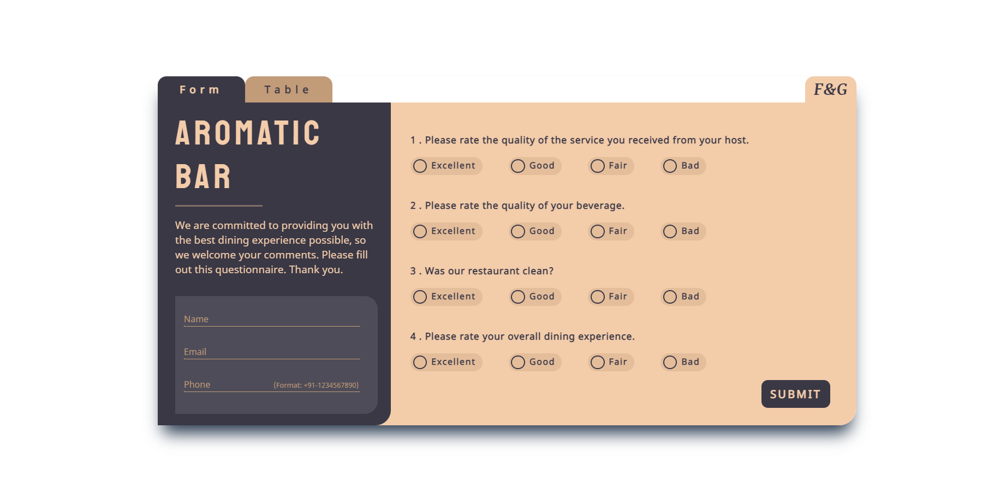
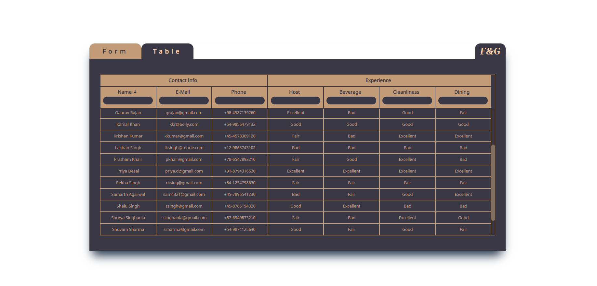

# Screenshots

# Description

- A feedback form for a restaurant/bar, with input validations, success message, local storage as database to store responses.
- A table retrieving data from local storage, displaying it in a table with abilities to sort and filter at each column.

# Project Live Link

- This project has been deployed to Github pages

# Instructions

- Clone repository from  'https://github.com/cs-mama/SENPIPER-TECHNOLOGIESassessment-'
- Change directory to project folder, and run 'npm install' in terminal to install the required dependencies
- To run project, run command 'npm run start'
